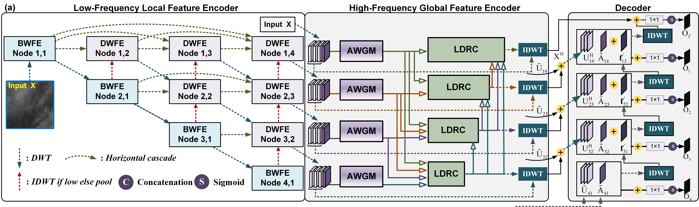

  
<h1>🔴 Infrared Small Target Detection via Wavelet-Driven Frequency Matching and Saliency-Difference Optimization</h1>

> #### Qianwen Ma, Shangwei Deng, Bincheng Li, Zhen Zhu, Ziying Song, Xiaobo Li&dagger;, and Haofeng Hu&dagger;
> &dagger;Correspondence

> Tianjin University, Beijing Jiaotong University

(a) Conventional downsampling and upsampling processes. SLVC is sliding local variance calculation, $4 \times$ is images with 4-fold downsampling followed by restoration to original size, where the processed texture images show differences and roughness compared to the pre-processed images. (b) Wavelet transform downsampling and upsampling processes, where the two texture images before and after processing exhibit extreme similarity.

  

(a) Conventional downsampling and upsampling processes. SLVC is sliding local variance calculation, $4 \times$ is images with 4-fold downsampling followed by restoration to original size, where the processed texture images show differences and roughness compared to the pre-processed images. (b) Wavelet transform downsampling and upsampling processes, where the two texture images before and after processing exhibit extreme similarity.

