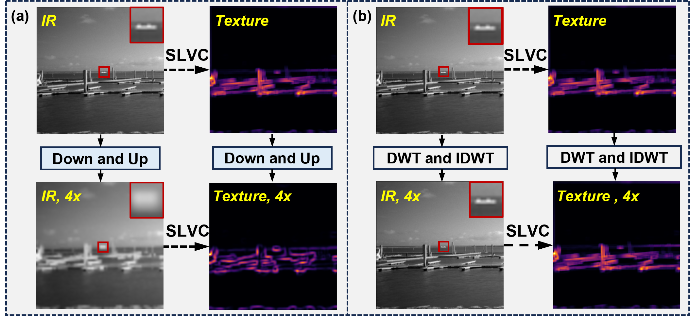
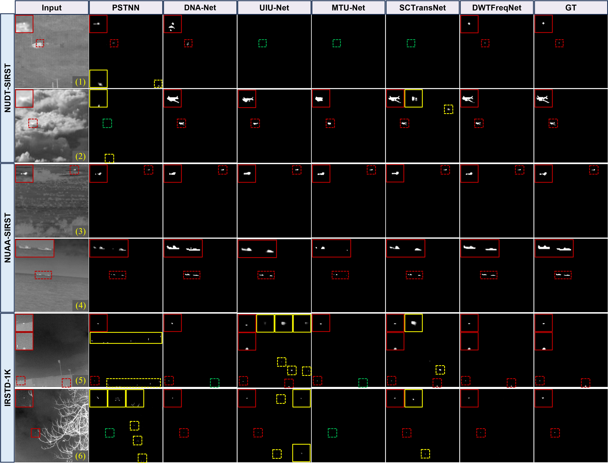

<div align="center">
  
<h1><span style="font-size:2em;">🔴</span> Infrared Small Target Detection via Wavelet-Driven Frequency Matching and Saliency-Difference Optimization</h1>
</div>

> #### Qianwen Ma, Shangwei Deng, Bincheng Li, Zhen Zhu, Ziying Song, Xiaobo Li<sup>&dagger;</sup>, and Haofeng Hu<sup>&dagger;</sup>
> <sup>&dagger;</sup>Correspondence

> Tianjin University, Beijing Jiaotong University

<div align="center">

<p align="center" style="font-style: italic;">
(a) Conventional downsampling and upsampling processes. SLVC is sliding local variance calculation, $4 \times$ is images with 4-fold downsampling followed by restoration to original size, where the processed texture images show differences and roughness compared to the pre-processed images. (b) Wavelet transform downsampling and upsampling processes, where the two texture images before and after processing exhibit extreme similarity.
</p>
  
---
</div>

<div align="center">

<p align="center" style="font-style: italic;">
(a) The overall framework of the proposed method. (b) The process of generating four low-resolution components from the input image through DWT downsampling and the process of upsampling back to a high-resolution image through IDWT. (c) The processing of two consecutive WFE modules. When the module is a DWFE, the feature maps will be concatenated with those from other nodes.
</p>

</div>

---

## :fire: News
* **[2025.08]** Current Status: TGRS R2!
* **[2025.08]** We release the code.  

---

## 💻 Requirements

- PyTorch >= 1.13.1  
- CUDA >= 11.3

---

# 🚀 Train and Inference Guide for DWTFreqNet

This section outlines the steps to run inference using the DWTFreqNet model.

---

### 📝 Step 1: Prepare the Dataset

Download the open-source infrared small target detection datasets we used:
[NUDT-SIRST](https://github.com/YeRen123455/Infrared-Small-Target-Detection), [NUAA-SIRST](https://github.com/YimianDai/open-deepinfrared), and [IRSTD-1K](https://github.com/RuiZhang97/ISNet).

Specify the dataset you want to train on and the path where the dataset is placed:
```python
parser.add_argument("--dataset_names", default=['NUDT-SIRST'], type=list)
parser.add_argument("--dataset_dir", default=r'../Dataset')
```

---

### ▶️ Step 2: Run Train

Run the train script:

```bash
python train.py
```

The output results will be saved to the `./log/` directory.

---

### ▶️ Step 3: Run Test

Run the test script:

```bash
python test.py
```

---

## 📊 Experimental Results

</div>

<div align="center">

</p>


